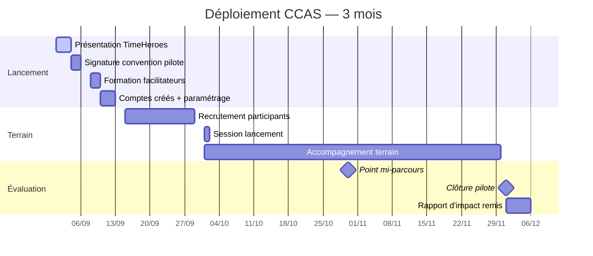

# 🏛️ Argumentaire CCAS — Pourquoi TimeHeroes ?

> **Document de prospection** pour les Centres Communaux d'Action Sociale
> Contact : Ronald Mounien — b00830928@essec.edu — timeheroes.fr

---

## Le constat — Pourquoi les CCAS ont besoin de TimeHeroes

| Problème | Situation actuelle | Avec TimeHeroes |
|----------|-------------------|-----------------|
| **Coordination des bénévoles** | Excel, papier, appels téléphoniques | Plateforme centralisée, dashboard en temps réel |
| **Traçabilité des heures** | Déclarations manuelles, pas de preuve | Ledger TIME tracé, escrow, QR/NFC validation |
| **Mesure d'impact** | Absente ou qualitative | 33 métriques wellbeing, rapports automatisés |
| **Reconnaissance des bénévoles** | Carte de bénévole, rien de plus | Badges, XP, réputation, passaport hero |
| **Rotation des bénévoles** | 25-40% de perte annuelle | Gamification + réciprocité TIME → rétention + |
| **Reporting financeurs** | Manuel, consommateur de temps | Rapports d'impact 1-clic, exportables |

> **60% des CCAS manquent d'outil numérique** pour coordonner leurs bénévoles (source : enquête ODENORE 2024)

---

## La solution en 3 mots

### 1️⃣ 1h de service = 1 TIME
Pas d'argent, pas de commission. Un système d'échange équitable où chaque heure donnée peut être réutilisée pour recevoir de l'aide en retour.

### 2️⃣ Programme clé en main
Le **programme Lien Social Seniors** est préconfiguré : services adaptés, missions solidaires vérifiées, rapport d'impact wellbeing avant/après.

### 3️⃣ Preuve d'impact
33 métriques quantitatives de bien-être. Les financeurs (Conférence des Financeurs, Fondations) exigent des résultats mesurables. TimeHeroes les fournit.

---

## Ce que ça coûte — Licence Pilote

| Pack | Prix | Inclus |
|:----:|:----:|:-------|
| 🚀 **Pilote 3 mois** | **300 €** | Accès complet, formation 2h, support prioritaire, rapport d'impact |
| 🏫 **Standard** | 300 €/mois | Dashboard facilitateur, programmes illimités, rapports d'impact |
| 🏆 **Premium** | 500 €/mois | Multi-sites, API, rapport d'impact personnalisé, accompagnement dédié |

> 💡 **Programme "Premier CCAS"** — Les 5 premiers CCAS signataires bénéficient du pilote **gratuit** (contre retours terrain et témoignages).

---

## Le retour sur investissement

### Coût vs valeur sociale

| Poste | Estimation |
|:------|:-----------|
| Coût licence annuelle | 3 600 € (Standard) |
| Heures d'entraide générées | ~1 000 h/an (estimation basse pour 30 membres actifs) |
| Valeur sociale créée (15 €/h) | **15 000 €** |
| **ROI social** | **× 4,2** |
| Économie sur coordination | ~10 h/mois agent CCAS × 12 mois = ~5 000 € économisés |
| **ROI global estimé** | **× 5,7** |

> Un CCAS récupère son investissement dès le 3ᵉ mois de fonctionnement du programme.

---

## 5 objections CCAS (et nos réponses)

| Objection | Réponse |
|:----------|:--------|
| *"On a déjà nos bénévoles, pas besoin d'outil"* | Vous les fidéliserez mieux avec une reconnaissance concrète (TIME, badges, réputation). Sans outil, vous ne mesurez pas votre impact — donc pas de rapport pour les financeurs. |
| *"C'est trop cher"* | 300 €/mois = 10 €/jour. C'est le prix d'un café par bénévole actif. Et le ROI social est ×5,7. Le **pilote gratuit** vous permet de tester sans risque. |
| *"Nos bénévoles ne sont pas à l'aise avec le numérique"* | TimeHeroes a été pensé pour tous les publics. Interface simplifiée, onboarding guidé, et nos facilitateurs forment vos équipes. |
| *"On veut pas une plateforme marchande"* | TimeHeroes n'est PAS une plateforme marchande. 1h = 1 TIME, pas d'argent, pas de commission. C'est un service public social. |
| *"On a déjà essayé un outil, ça n'a pas marché"* | Les autres outils ne font pas de timebanking réciproque. TimeHeroes crée une **boucle donner/recevoir** qui motive les bénévoles. Et la **gamification** fait la différence. |

---

## Calendrier de déploiement

---

## Pourquoi maintenant ?

| Raison | Détail |
|:-------|:-------|
| 🎯 **Appel à projets CCAS 2027** | Les budgets solidarité augmentent, la mesure d'impact est un critère de sélection |
| 📈 **CSRD** | Les collectivités doivent mesurer leur impact social — TimeHeroes le fait pour elles |
| 🧓 **Urgence seniors** | 2M de seniors isolés — le programme Lien Social est une réponse concrète, finançable |
| 🆓 **Pilote gratuit** | Pas de risque pour le CCAS, pas d'engagement, pas de budget |
| ✅ **Déjà en ligne** | Le POC est opérationnel, pas besoin d'attendre un développement |

---

## Check-list avant signature

- [ ] Identifier le référent CCAS (directeur / chargé de mission)
- [ ] Présenter le concept en 5 min avec le deck pitch
- [ ] Démontrer la plateforme (temps réel sur timeheroes.fr)
- [ ] Partager le rapport d'impact démo
- [ ] Faire signer la convention de pilote
- [ ] Planifier la formation facilitateur (2h en visio)
- [ ] Fixer la date de kickoff

---

> **TimeHeroes** — 1h de service = 1 TIME — **timeheroes.fr**
> Argumentaire CCAS · Juillet 2026 · Ronald Mounien — ESSEC EMBA WE27
